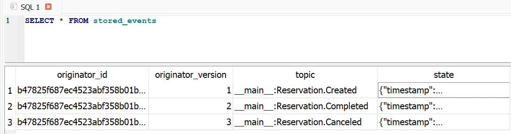
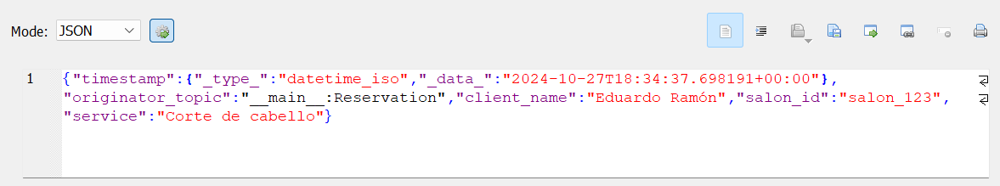

# Event Sourcing

### Proceso de implementación
La implementación se dividió en varios pasos clave. Para ello, se utilizó la librería `eventsourcing` y Python 3.10.11:

1. **Creación de la Clase Reservation:** Se definió `Reservation` como el agregado principal, con eventos asociados a cada cambio de estado.

2. **Construcción de InStudioApplication:** Esta aplicación gestiona la lógica de negocio y ofrece métodos para registrar, cancelar y completar reservas, controlando el flujo y la persistencia de eventos.

3. **Configuración del Repositorio SQLite:** Se utilizó SQLite como sistema de almacenamiento para los eventos, proporcionando un repositorio persistente que registra cada modificación de estado.

### Validación y prueba
Para validar el correcto funcionamiento de la aplicación, se desarrolló una prueba que confirma que los eventos de estado son registrados y recuperados con precisión. Esto asegura que cada evento de la reserva queda almacenado y puede ser consultado en cualquier momento, lo que es fundamental para el análisis y auditoría de los datos. A continuación se mostrará y explicará cada bloque de código para llevar a cabo la demostración.

### Código

```python
from eventsourcing.domain import Aggregate, event
from eventsourcing.application import Application
import os

os.environ["PERSISTENCE_MODULE"] = 'eventsourcing.sqlite'
os.environ["SQLITE_DBNAME"] = 'instudio.db'
```
Aquí se configura el entorno para el almacenamiento de eventos. Se utiliza SQLite como base de datos para persistir los eventos, y se define el nombre del archivo de la base de datos como instudio.db.

```python
class Reservation(Aggregate):
  @event('Created')
  def __init__(self, client_name, salon_id, service):
    self.client_name = client_name
    self.salon_id = salon_id
    self.service = service
    self.status = "Pending"
    
  @event('Canceled')
  def cancel(self):
    self.status = "Canceled"

  @event('Completed')
  def complete(self):
    self.status = "Completed"
```
Aquí se define la clase Reservation, que representa la reserva como un agregado de dominio. Esta clase maneja tres eventos principales:

- Creación (Created): Registra una nueva reserva con el estado inicial "Pending".
- Cancelación (Canceled): Cambia el estado de la reserva a "Canceled".
- Finalización (Completed): Cambia el estado de la reserva a "Completed".

Cada cambio de estado está decorado con @event, lo que asegura que se registre en el historial de eventos.

```python
class InStudioApplication(Application):
    def create_reservation(self, client_name, salon_id, service):
        reservation = Reservation(client_name, salon_id, service)
        self.save(reservation)
        return reservation.id

    def cancel_reservation(self, reservation_id):
        reservation = self.repository.get(reservation_id)
        reservation.cancel()
        self.save(reservation)

    def complete_reservation(self, reservation_id):
        reservation = self.repository.get(reservation_id)
        reservation.complete()
        self.save(reservation)

    def get_reservation(self, reservation_id):
        reservation = self.repository.get(reservation_id)
        return {
            'client_name': reservation.client_name,
            'salon_id': reservation.salon_id,
            'service': reservation.service,
            'status': reservation.status
        }
```

InStudioApplication actúa como la capa de aplicación que gestiona las operaciones sobre las reservas. Sus métodos incluyen:

- create_reservation: Crea una nueva reserva y la guarda en el repositorio.
- cancel_reservation: Cancela una reserva existente utilizando su ID.
- complete_reservation: Marca una reserva como completada.
- get_reservation: Recupera los detalles actuales de una reserva, incluyendo el nombre del cliente, el servicio, y el estado.

Cada vez que se cambia el estado de una reserva, se guarda un evento en el repositorio, registrando así cada modificación en el tiempo.

```python
def test_instudio_application():
    instudio_app = InStudioApplication()

    reservation_id = instudio_app.create_reservation('Eduardo Ramón', 'salon_123', 'Corte de cabello')
    instudio_app.complete_reservation(reservation_id)

    reservation = instudio_app.get_reservation(reservation_id)
    assert reservation['client_name'] == 'Eduardo Ramón'
    assert reservation['status'] == 'Completed'

    instudio_app.cancel_reservation(reservation_id)
    reservation = instudio_app.get_reservation(reservation_id)
    assert reservation['status'] == 'Canceled'

    notifications = instudio_app.notification_log.select(start=1, limit=10)
    assert len(notifications) == 3

test_instudio_application()
```

La función test_instudio_application es una prueba unitaria para validar que las reservas se crean y gestionan correctamente. Se realizan los siguientes pasos:

- Crear una reserva para un cliente y completar el estado a "Completed".
- Cancelar la reserva y verificar que el estado cambia a "Canceled".
- Consultar el registro de notificaciones para confirmar que se han registrado tres eventos: creación, completado y cancelación.

Luego de ejecutar los bloques de código y efectuar las pruebas descritas, en la tabla `stored_events` de la base de datos SQLite, se registrarán todos los eventos generados.


Se puede apreciar los 3 eventos generados, entre ellos, la creación de la reserva como `Reservation.Created` y su cambio de estado a completada y cancelada como `Reservation.Completed` y `Reservation.Canceled` respectivamente.


Concretamente para el tópico de creación de reserva, se almacena el momento del evento y los atributos como `client_name`, `salon_id`, `service`, el cual permite tener un registro más descriptivo.
